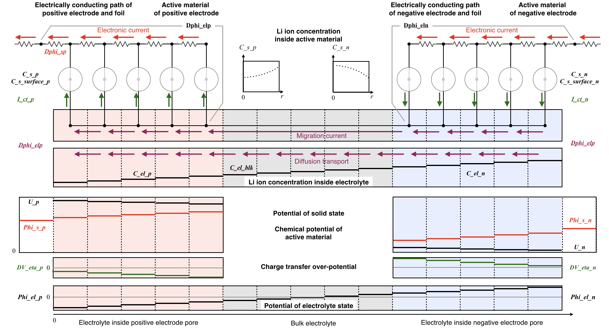
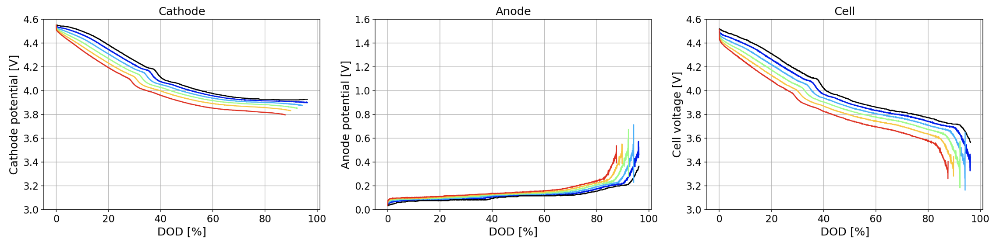
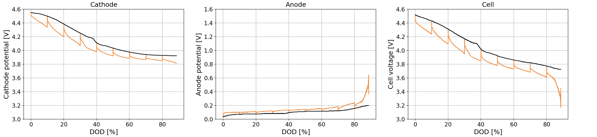

# LiBSimPy  
Li-ion battery simulator. This simulator was developed with 100&#37; private resource.  
This simulator is designed for Li ion battery discharge curve simulation (Newman model).  

Schematic Diagram
  
Simulation Result  

